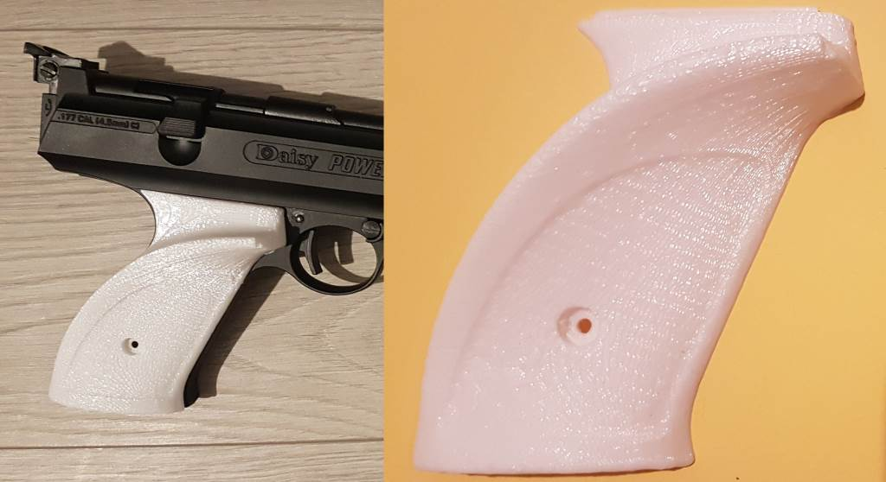
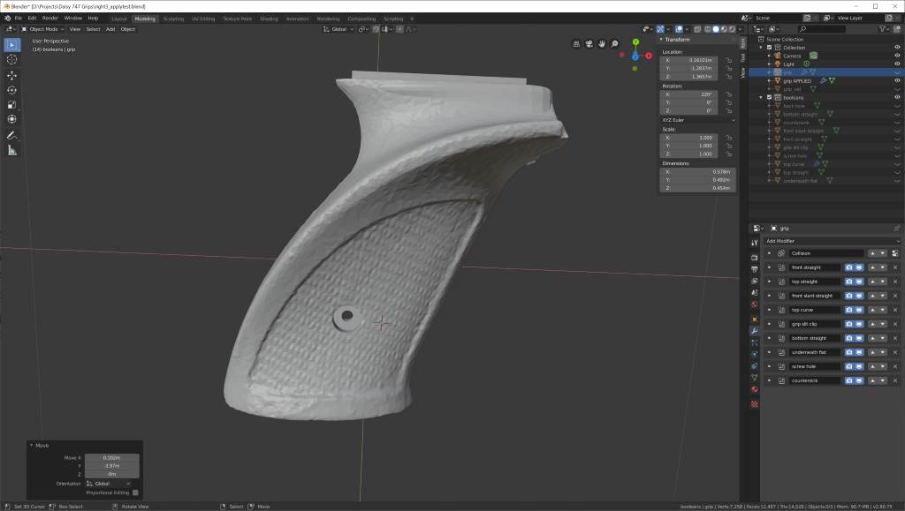
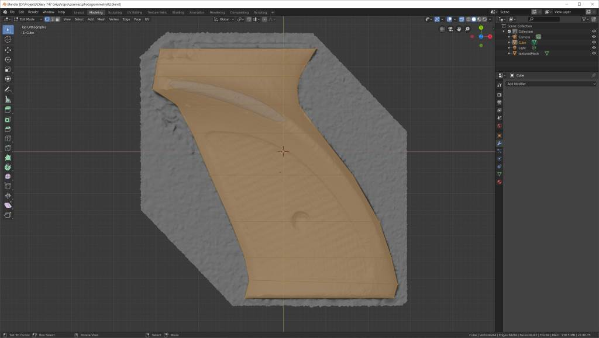
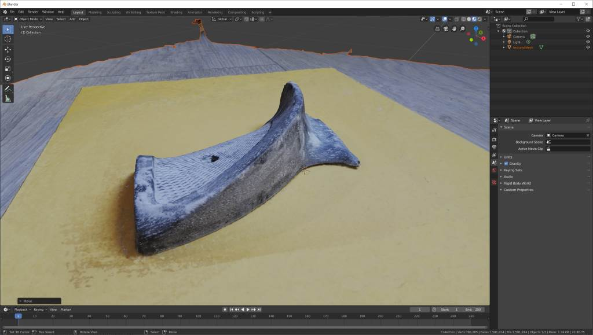

# Left-handed Daisy 717/747 air pistol grips

## TL;DR;
Download `left-grip.stl` and `right-grip.stl` and 3D print them.  
Check out the Blender files in `sources` if you want to edit anything.  
**NOTE**: this is a **WIP**, not perfect yet.

  * Having made the grip bulgier on the left side, the screw countersink isn't deep enough, so the screw no longer reaches the screwhole, meaning you can't actually attach it right now.
  * The bottom of the left grip is a bit saggy, need to tighten it up a bit
  * The thin extrusion at the top to "lock" into the slot on the gun is way too small on the left side (needs a 2x scale, probably), and too large on the right side.

## Blog

I recently bought a second-hand [Daisy 747 air pistol](https://www.pyramydair.com/s/m/Daisy_Match_Grade_Avanti_747_Triumph_Match/308) with the intent of becoming an Olympic-quality target shooter.

I really like it, but it wasn't built for *sinister* people like me.  
This is due to the existing left grip being specially shaped to house the thumb of the right hand.

I searched near and far online for lefty replacements, but alas, no left-handed dice.  
So I decided to remake the grips for lefties, or at the very least, a mirrored version of the right grip for the left (for now, I'm going to try something else for the more complicated thumb-grip).

And seeing as I never ever do something even remotely properly, I'm putting this out into the world so I can at least try and shame myself into making a tiny bit of an effort (and [Thingiverse](http://www.thingiverse.com) just isn't working for me).

I've never used photogrammetry before, nor have I tried replicating a real-world object, so below lie the details of my misadventures.

### Update 7

It actually almost worked first time! And I didn't run out of filament!

  * Once again, the back hole isn't deep enough *(easily fixed with a drill)*
  * The top grip slit clip is mildly too thick *(a very quick sand/file fixed it)*

Oh man, so happy.  
Even though I printed draft at 0.3mm, the stipling and grip texture is great!  
Such a good result from so much less work, I think I'll have to redo the other simpler grip in this way, too.

Gotta fix the scales in my files, though.  
This grip needs to be 94mm high for printing, so exported at 160 times scale.  
Whereas the other side needs to be exported at 250 times scale.  
Lessons learnt the hard way.

But now I have to wait for filament to arrive from Amazon before I can continue.  
My *wood* filament...

### Update 6

After the talcum powder worked so well with the photogrammetry process, I figured, "Why try hard and make a box repro, why not just MASH BOOLEAN BITS INTO IT until it takes shape?"

*et voilà*, work is done.  
Not quite, but still.

As you can clearly see, it's a mess, I'm not sure about the shape or scale, but ever the hopeless optimist (that's why I'm always so sad!), I'm giving it a print with the remaining bit of filament I have left.

It has the stipling on! My horse for stipling!

I pulled the photogrammetry mesh in, boolean'd the hell out of it, then sculpted bits until it "looked right".

The 3D print that will be done in an hour will tell me how wrong my right is.

*hopefully I won't be needing YOU any more...*

### Update 5

Well Josh Groban me sideways, adding [talcum powder](https://www.cancer.org/cancer/cancer-causes/talcum-powder-and-cancer.html) and retrying the photogrammetry process worked like a dream (and not like the ones where I've accidentally chewed too hard and crushed my teeth into bits and have to slowly spit them out)!

It's going to be so much less impossible for me to attempt this complicated piece now, with the bonus of me just being able to wash it when I fail!

### Update 4

Cheesy crust and the mother Maredsous... adding a texture to the grips was *difficult*.

Not only is it almost impossible to search for *"blender surface texture"*, but trying to get the texture (read: real world feeling on your fingers, stippling, *not an image*) to follow the shape of the mesh was really difficult, *for me*.

I really just wanted to project an image containing a stipple onto the grip, and then displace it, thank you bye bye now.

But nooo.

I feel that I should point out that I have rarely done anything more complicated in [Blender](https://www.blender.org/) than play with the fluid sim, occasionally fixing TinkerCad bits, and [making very simple cubey things](https://www.deviantart.com/noshbar).

So it is with much remorse that I explain how I got the "stipple" on the grip:

  * made a procedural triangle texture
  * duplicated the grip
    * applied all the modifiers
    * cut out just the bit I wanted to have stippling on
    * added a displacement modifier
    * used the triangle texture for the displacement
    * added a subdivision modifier
  * slowly moved the duplicated bits down until they looked "right".

Looking back at what I just wrote, I don't think I was being that stupid, but I really thought I would just be able to take an image of a stippled texture and "stamp" it on using the sculpting tools, or something.

But when I looked into sculpting and making my own brush with a custom material, a. I am a stupid, and b. it would only ever "paint"/"stamp" in a circle shape, which if I made large enough to cover the area I wanted, it'd mess up the clean edges of the grip.
It would also displace the back of the grip, for some reason, even if X-Ray was off.

I also tried making the grip bulkier for a more comfortable grip in *my hand*, and it resulted in:

  * being much more comfortable *for me*
  * being broken, in that the screw no longer reaches the screwhole.

So yeah. You live, you learn.  
And I have so much more to live.

P.S. I can't wait for this grip to be finished "good enough" so I can print it out as a cast and shove some clay in there and see what that's like!

I *was* going to spurt a whole tube of plastic wood in there for that real authentic wood with less throat-burn, but after my earlier failed experiment, maybe not.

Although, if I gather a bunch of the sawdust I've generated over the past month and mix it with glue...

### Update 3

I fixed the vertical scale, but then left a weird saggy bit at the bottom, because I take pride in my work.

I was playing with print settings, hence the back hole looks as if it has had sunnier days.

But overall, the grip actually feels rather good now, however the sharp back piece is still outside the bounds of the grip area a bit, so will probably be uncomfortable in the long run.

I also imagine this becoming slightly slippery after prolonged usage, so I need to learn how to add a stippling texture or something.

### Update, number 2

No, that's not the result of finding where the sun doesn't shine and storing it there.
No no, this is the result of me thinking, *"I wonder what it would look like if it were slightly more wood"*, and then stupidly going to the hardware store (where I really shouldn't be allowed in) and buying "plastic wood", smearing it all over, and carefully sanding it poorly.

It doesn't look like wood.  
It doesn't smell like wood.  
But it *is* slightly more grippy now...

No.

### Update 1

screenshot of the photogrammetry result, available in `sources/photogrammetry01.blend`

I took 20 poorly-lit photos of the existing grips and shoved them into [MeshRoom](https://alicevision.org/#meshroom), which only took a few minutes to give me a really gross point cloud.

From there, I imported the `OBJ` into [Blender 2.8](https://www.blender.org/) and removed a bunch excess points to make things a little more responsive. The screenshot above is the result of that process.

Above is my first attempt at box sculpting.  
I started with a cube, extruded it a few times, trying to match the outline of the sides first.  
After that I made a loop cut (`CTRL-R`), increasing the amount of cuts a few times (mousewheel up) so I could get some more detail following the shape.

From there I simply grabbed the top vertices one by one, and lowered them until I just wasn't seeing any of the photogrammetry mesh peeking through (well, except the bottom bits, did I mention I don't do anything in my spare time properly?).

With that done, I added a subsurface modifier -2 levels- and used a boolean-cube to cut the bottom of my subsurface flat.

It was printing time!  
0.3mm layers, 10% infill, go Anycubic i3 Mega, go!  
*Side note: I really really like the Mega. I've printed 2 spools worth of stuff on it so far, and it hasn't failed once.* 

Success-ish!  
I somehow buggered up the vertical scale, and I kinda forgot to put a hole in the back, but nothing a bit of tracing and drill bits can't solve!

Teething and hand pains aside, it actually works!
